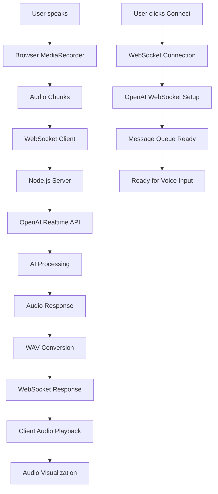

# Pioneer Voice Assistant

A real-time voice conversation AI assistant built using OpenAI's GPT-4o Realtime API with WebSocket connections.

## Features

- Real-time voice conversation with AI
- Audio visualization during playback
- WebSocket-based communication
- Modern Next.js frontend with Node.js backend

## Tech Stack

- **Frontend**: Next.js, React, Tailwind CSS
- **Backend**: Node.js, WebSocket
- **AI**: OpenAI GPT-4o Realtime API
- **Audio**: Custom WAV processing, Web Audio API

## Getting Started

### Prerequisites
- Node.js 18+
- OpenAI API key

### Installation

1. Clone the repository
2. Install dependencies:
   ```bash
   # Client
   cd client && npm install
   
   # Server  
   cd server && npm install
   ```

3. Set up environment variables:
   ```bash
   # In server directory
   echo "KEY=your_openai_api_key" > .env
   ```

4. Run the application:
   ```bash
   # Server (in server directory)
   npm run dev
   
   # Client (in client directory) 
   npm run dev
   ```

5. Open http://localhost:3000 in your browser

## Architecture

### Directory Structure
- **Client/**: Next.js React application
- **Server/**: Node.js WebSocket server
- **Real-time Communication**: WebSocket proxy to OpenAI's API

### Workflow Architecture



### Data Flow Process

#### 1. **Initialization Phase**
```
Client (React) → WebSocket Connection → Server → OpenAI API Setup
```
- User clicks "Connect to Assistant"
- Client establishes WebSocket connection to `ws://localhost:4000/Assistant`
- Server creates WebSocket connection to OpenAI's Realtime API
- Message queue system handles connection timing

#### 2. **Voice Input Flow**
```
Microphone → MediaRecorder → Audio Chunks → WebSocket → Server → OpenAI
```
- Browser's `MediaRecorder` captures audio from microphone
- Audio is recorded in chunks and sent via WebSocket
- Server forwards audio data to OpenAI's Realtime API
- OpenAI processes speech and generates response

#### 3. **Audio Processing Pipeline**
```
OpenAI PCM Data → Base64 → ArrayBuffer → WAV Header → WAV File → Client
```
- OpenAI returns PCM audio data in base64 format
- Server converts base64 to ArrayBuffer using `audiofunctions.js`
- WAV header is created (24kHz, mono, 16-bit)
- Complete WAV file sent back to client

#### 4. **Response Playback Flow**
```
WAV File → Web Audio API → AudioBuffer → Speakers + Canvas Visualization
```
- Client receives WAV file as ArrayBuffer
- Web Audio API decodes audio data
- Audio plays through speakers
- Real-time frequency visualization on canvas

### Key Components

#### Server Components
- **WebSocket Server** (`server/index.js`):
  - Handles client connections on `/Assistant` endpoint
  - Manages OpenAI API proxy connections
  - Implements message queuing for reliability
  - Processes audio data conversion

- **Audio Utilities** (`server/utils/audiofunctions.js`):
  - `base64ToArrayBuffer()`: Converts OpenAI audio format
  - `createWavHeader()`: Generates WAV file headers
  - `concatenateWavHeaderAndData()`: Combines header and audio

#### Client Components
- **Main Interface** (`client/src/pages/index.js`):
  - WebSocket connection management
  - Audio recording with `MediaRecorder`
  - Audio playback with Web Audio API
  - Canvas-based audio visualization
  - Real-time message handling

- **Audio Visualization**:
  - Frequency analysis using `AnalyserNode`
  - Canvas rendering with requestAnimationFrame
  - Real-time bar graph visualization

### Connection Management

#### Error Handling
- WebSocket reconnection logic
- OpenAI API error propagation
- Audio processing error handling
- Connection state management

#### Message Queue System
- Queues messages until OpenAI connection is ready
- Prevents message loss during connection setup
- Ensures reliable message delivery

### Technical Specifications

#### Audio Format
- **Sample Rate**: 24kHz (OpenAI Realtime API standard)
- **Channels**: Mono
- **Bit Depth**: 16-bit
- **Format**: WAV with PCM encoding

#### WebSocket Endpoints
- **Client → Server**: `ws://localhost:4000/Assistant`
- **Server → OpenAI**: `wss://api.openai.com/v1/realtime`
- **Model**: `gpt-4o-realtime-preview-2024-10-01`

#### Dependencies
- **Server**: `ws`, `dotenv`, `nodemon`
- **Client**: `next`, `react`, `react-audio-visualize`, `ws`

## Project History

This project was initially developed in November 2024, ahead of the mainstream voice AI trend, demonstrating early innovation in real-time voice interfaces.

## License

MIT License
